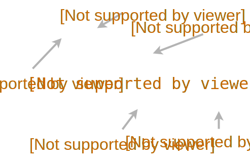

title: CSS 概览

---

# CSS - 概念、选择器

---

## 版本 (Level)

* ~~CSS Level 1~~
* CSS Level 2 (CSS 2.1 规范)
* CSS Level 3

  * Color Module Level 3
  * Selectors Level 3
  * Media Queries
  * Fonts Level 3
  * ...

---

## CSS 规则



---

## 代码风格

```css
h1 { color: red; font-size: 14px; }

h1 {
  color: red;
  font-size: 14px;
}
```

---

## 使用 CSS

```markup
<!-- 外链 -->
<link rel="stylesheet" href="/path/to/style.css">

<!-- 嵌入 -->
<style type="text/css">
  li { margin: 0; list-style: none; }
  p { margin: 1em 0; }
</style>

<!-- 内联 -->
<p style="margin:1em 0">Example Content</p>
```

---

## 注释

```css
/* 设置按钮宽度 */
.form button {
  width: 240px;
}

/**
 * 设置默认样式
 */
body {
  margin: 0;
  /* font-size: 12px; */
  //color: #333;
}

```


---

## 选择器

选择器用来从页面中选择元素，以给它们定义样式。

---

## 通配选择器

```css
/* 匹配所有元素 */
* {
  box-sizing: inherit;
}
```

---

## 标签选择器

```css
/* 匹配所有p元素 */
p {
  margin: 1em 0;
}
```

---

## id 选择器

```markup
<p id="example">Example Content</p>

<style type="text/css">
  /* 匹配id为example的元素
   * 注意：id 值在一个 HTML 中必须唯一
   */
  #example {
    font-size: 14px;
    line-height: 1.6;
    color: red;
  }
</style>
```

---

## 类选择器

```markup
<p class="warning">这是一条警告信息</p>

<!-- 可以给一个元素指定多个class，用空格隔开 -->
<p class="warning icon">这是另外一条警告信息</p>

<style type="text/css">
  .warning {
    color: orange;
  }
  .icon {
    background: url(warn.png) no-repeat 0 0;
  }
</style>
```

---

## 简单选择器

* 通配选择器
* 标签选择器
* ID选择器
* 类选择器

---

## 属性选择器

```markup
<p>
  <label>用户名：</label>
  <input name="username" value="zhao" disabled>
</p>

<style>
  input[disabled] {
    background: #eee;
    color: #999;
    cursor: not-allowed;
  }
</style>
```

---

```markup
<p>
  <label>密码：</label>
  <input type="password" required>
</p>

<style>
  input[type="password"] {
    border-color: red;
    color: red;
  }
</style>
```

---

<div style="font-variant-ligatures:none">

```markup
<p>
  <label>身高：</label>
  <input name="height">
</p>
<p>
  <label>体重：</label>
  <input name="weight">
</p>
<p>
  <label>BMI：</label>
  <output for="weight height">22</output>
</p>

<style>
  [for~="height"] {
    color: red;
  }
</style>
```

</div>

---

```markup
<p><a href="#top">回到顶部</a></p>
<p><a href="/home">返回首页</a></p>

<style>
  a[href^="#"] {
    color: red;
  }
</style>
```

---

```markup
<p>你可以<a href="a.jpg">查看原图</a></p>

<style>
  a[href$=".jpg"] {
    color: red;
  }
</style>
```

---

```markup
<i class="icon-user">用户</i>
<i class="icon-wifi">WiFi</i>
<i class="other1 icon-car">汽车</i>
<i class="icon-heart other2">爱心</i>

<style>
  [class^="icon-"], [class*=" icon-"] {
    color: coral;
    font-family: FontAwesome;
    font-style: normal;
    margin-right: 1em;
  }
  .icon-user::before {
    content: '\f007';
  }
  .icon-wifi::before {
    content: '\f1eb';
  }
  .icon-car::before {
    content: '\f1b9';
  }
  .icon-heart::before {
    content: '\f004';
  }
</style>
```

---

## 伪类 (pseudo-classes)

基于 DOM 之外的信息去（比如根据用户和网页的交互状态）选择元素。

```css
a:link    { ... }   /* 未访问过的链接 */
a:visited { ... }   /* 已访问过的链接 */

a:hover   { ... }   /* 鼠标移到链接上的样式 */
a:active  { ... }   /* 鼠标在连接上按下时的样式 */
a:focus   { ... }   /* 获得焦点时的样式 */
```

---

```markup

<nav>
  <ul>
    <li><a href="http://w3.org">W3C</a>
    <li><a href="http://example.com">example.com</a>
    <li><a href="http://www.360.com">360</a>
  </ul>
</nav>

<label>搜索：<input name="q" type="search"></label>

<style>
  a:link {
    color: black;
  }
  a:visited {
    color: gray;
  }
  a:hover {
    color: orange;
  }
  a:active {
    color: red;
  }
  :focus {
    outline: 2px solid red;
  }
</style>

```

---

## 选择器组合

* 直接组合 EF
* 后代组合 E F
* 亲子组合 E > F

---

## 直接组合 EF

```markup
<p class="warning">这是一条警告信息</p>
<div class="warning icon">这是另外一条警告信息</div>
```

```css
p.warning { color: orange; }
```

---

## 组合形式

```
E[foo="bar"]
E.warning
E#myid
#myid.warning
.warning[foo="bar"]
```

---

## 后代组合 E F

```markup
<article>
  <h1>拉森火山国家公园</h1>
  <p>拉森火山国家公园是位于美国加州北部的国家公园，整个国家公园
  中最主要的景观就是拉森火山，是世界上最大的穹顶火山，也是喀斯喀
  特山脉中最南端的火山。</p>
  <section>
    <h2>气候</h2>
    <p>因为拉森火山国家公园是处于中高海拔地区，在7500呎以下，其
    气候大体来说是冬冷夏温。高于这个高度，气候非常寒冷，连夏天都
    不太热。</p>
  </section>
</article>

<style>
  /* 后代选择器 */
  article p {
    color: coral;
  }
  /* 亲子选择器 */
  article > p {
    color: limegreen;
  }
  article section h2 {
    border-bottom: 1px dashed #999;
  }
</style>
```

---

## 同时为一组选择器定义样式

```css
body, h1, h2, h3, h4, h5, h6, ul, ol, li {
  margin: 0;
  padding: 0;
}

[type="checkbox"], [type="radio"] {
  box-sizing: border-box;
  padding: 0;
}
```

---

bgcolor: green

<<+++++++++ :fa-comments: +>>

